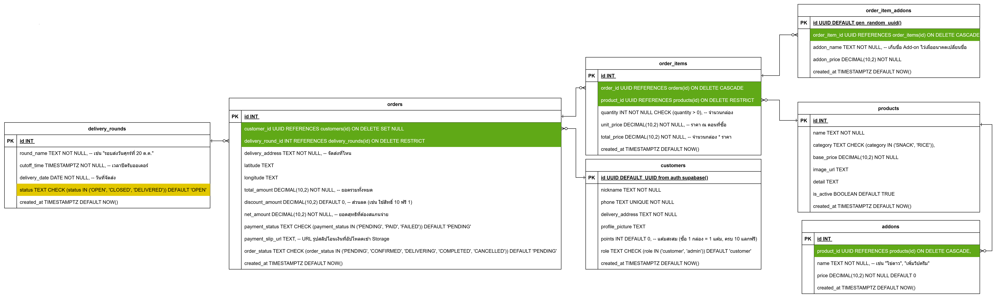

# This is A Food Delivery

## Database


## SQL Command
```sql
-- 1. ตารางลูกค้า (customers)
CREATE TABLE customers (
    id UUID REFERENCES auth.users(id) ON DELETE CASCADE PRIMARY KEY,
    nickname TEXT,
    phone TEXT,
    delivery_address TEXT,
    profile_picture TEXT,
    points INT DEFAULT 0,
    role TEXT CHECK (role IN ('admin', 'user')) DEFAULT 'user',
    created_at TIMESTAMPTZ DEFAULT NOW()
);

-- 2. ตารางรอบการจัดส่ง (delivery_rounds)
CREATE TABLE delivery_rounds (
    id SERIAL PRIMARY KEY,
    round_name TEXT NOT NULL,
    cutoff_time TIMESTAMPTZ NOT NULL,
    delivery_date DATE NOT NULL,
    status TEXT CHECK (status IN ('OPEN', 'CLOSED', 'DELIVERED')) DEFAULT 'OPEN',
    created_at TIMESTAMPTZ DEFAULT NOW()
);

-- 3. ตารางสินค้า (products)
CREATE TABLE products (
    id SERIAL PRIMARY KEY,
    name TEXT NOT NULL,
    category TEXT CHECK (category IN ('SNACK', 'RICE')),
    base_price DECIMAL(10,2) NOT NULL,
    image_url TEXT,
    detail TEXT,
    is_active BOOLEAN DEFAULT TRUE,
    created_at TIMESTAMPTZ DEFAULT NOW()
);

-- 4. ตาราง Add-on (addons)
CREATE TABLE addons (
    id SERIAL PRIMARY KEY,
    product_id INT REFERENCES products(id) ON DELETE CASCADE,
    name TEXT NOT NULL,
    image_url TEXT,
    price DECIMAL(10,2) NOT NULL DEFAULT 0,
    created_at TIMESTAMPTZ DEFAULT NOW()
);

-- 5. ตารางออเดอร์ (orders)
CREATE TABLE orders (
    id SERIAL PRIMARY KEY,
    customer_id UUID REFERENCES customers(id) ON DELETE SET NULL,
    delivery_round_id INT REFERENCES delivery_rounds(id) ON DELETE RESTRICT,
    delivery_address TEXT NOT NULL,
    latitude FLOAT,
    longitude FLOAT,
    total_amount DECIMAL(10,2) NOT NULL,
    discount_amount DECIMAL(10,2) DEFAULT 0,
    net_amount DECIMAL(10,2) NOT NULL,
    payment_status TEXT CHECK (payment_status IN ('PENDING', 'PAID', 'FAILED')) DEFAULT 'PENDING',
    payment_slip_url TEXT,
    order_status TEXT CHECK (order_status IN ('PENDING', 'CONFIRMED', 'DELIVERING', 'COMPLETED', 'CANCELLED')) DEFAULT 'PENDING',
    created_at TIMESTAMPTZ DEFAULT NOW()
);

-- 6. ตารางรายการสินค้าในออเดอร์ (order_items)
CREATE TABLE order_items (
    id SERIAL PRIMARY KEY,
    order_id INT REFERENCES orders(id) ON DELETE CASCADE,
    product_id INT REFERENCES products(id) ON DELETE RESTRICT,
    quantity INT NOT NULL CHECK (quantity > 0),
    unit_price DECIMAL(10,2) NOT NULL,
    total_price DECIMAL(10,2) NOT NULL,
    created_at TIMESTAMPTZ DEFAULT NOW()
);

-- 7. ตาราง Add-on ที่ลูกค้าเลือกในออเดอร์ (order_item_addons)
CREATE TABLE order_item_addons (
    id UUID PRIMARY KEY DEFAULT gen_random_uuid(),
    order_item_id INT REFERENCES order_items(id) ON DELETE CASCADE,
    addon_name TEXT NOT NULL,
    addon_price DECIMAL(10,2) NOT NULL,
    created_at TIMESTAMPTZ DEFAULT NOW()
);
```

## Trigger
```sql
-- 1. ลบ Trigger และ Function ตัวเก่าทิ้งก่อน (เพื่อความชัวร์)
-- DROP TRIGGER IF EXISTS on_auth_user_created ON auth.users;
-- DROP FUNCTION IF EXISTS public.handle_new_user();

-- 2. สร้าง Function ใหม่ (Insert แค่ id และ created_at)
CREATE OR REPLACE FUNCTION public.handle_new_user()
RETURNS trigger AS $$
BEGIN
  INSERT INTO public.customers (
    id, 
    created_at
  )
  VALUES (
    NEW.id,
    NEW.created_at -- ใช้เวลาเดียวกับตอนสร้าง user ใน auth.users
  );
  
  RETURN NEW;
END;
$$ LANGUAGE plpgsql SECURITY DEFINER SET search_path = public;

-- 3. สร้าง Trigger ให้ทำงานอัตโนมัติเมื่อมีการ Insert ลงตาราง auth.users
CREATE TRIGGER on_auth_user_created
  AFTER INSERT ON auth.users
  FOR EACH ROW EXECUTE FUNCTION public.handle_new_user();
```


## Example Data
```sql
-- 1. เพิ่มข้อมูลลงตาราง products (20 แถว)
INSERT INTO products (name, category, base_price, detail, image_url) VALUES
-- ข้าว (RICE)
('ข้าวผัดกระเพราหมูสับ', 'RICE', 55.00, 'กระเพราแท้รสจัดจ้าน ไม่ใส่ถั่วฝักยาว', 'https://via.placeholder.com/300?text=Kaprao'),
('ข้าวผัดพริกแกงไก่', 'RICE', 60.00, 'พริกแกงเข้มข้นถึงเครื่อง', 'https://via.placeholder.com/300?text=PrikGaeng'),
('ข้าวหมูกระเทียม', 'RICE', 55.00, 'หมูนุ่มกระเทียมกรอบ หอมพริกไทย', 'https://via.placeholder.com/300?text=GarlicPork'),
('ข้าวไก่ทอดซอสน้ำปลา', 'RICE', 65.00, 'ไก่กรอบๆ ราดซอสน้ำปลาสูตรเด็ด', 'https://via.placeholder.com/300?text=FishSauceChicken'),
('ข้าวหมูแดงฮ่องกง', 'RICE', 70.00, 'หมูแดงย่างเตาถ่าน น้ำราดกลมกล่อม', 'https://via.placeholder.com/300?text=RedPork'),
('ข้าวไข่ข้นกุ้ง', 'RICE', 85.00, 'ไข่นุ่มๆ กับกุ้งสดเด้งๆ', 'https://via.placeholder.com/300?text=CreamyEgg'),
('ข้าวหน้าเนื้อย่าง', 'RICE', 120.00, 'เนื้อวัวพรีเมียมย่าง medium rare', 'https://via.placeholder.com/300?text=BeefRice'),
('ข้าวคลุกกะปิ', 'RICE', 65.00, 'เครื่องเคียงครบครัน หอมกะปิอย่างดี', 'https://via.placeholder.com/300?text=KapiRice'),
('ข้าวผัดรถไฟ', 'RICE', 60.00, 'ข้าวผัดสีชมพูสูตรโบราณ', 'https://via.placeholder.com/300?text=PinkRice'),
('ข้าวยำปลาทู', 'RICE', 65.00, 'ปลาทูเน้นๆ พร้อมเครื่องสมุนไพร', 'https://via.placeholder.com/300?text=MackerelRice'),

-- ขนม (SNACK)
('บราวนี่ดาร์กช็อก', 'SNACK', 45.00, 'ดาร์กช็อกโกแลต 70% หน้าฟิล์ม เนื้อหนึบ', 'https://via.placeholder.com/300?text=Brownie'),
('คุ้กกี้เนยสด', 'SNACK', 35.00, 'ใช้เนยแท้ ไร้ไขมันทรานส์', 'https://via.placeholder.com/300?text=ButterCookie'),
('เค้กส้มหน้านิ่ม', 'SNACK', 55.00, 'ซอสส้มคั้นสด รสเปรี้ยวอมหวาน', 'https://via.placeholder.com/300?text=OrangeCake'),
('ครัวซองต์เนยฝรั่งเศส', 'SNACK', 85.00, 'หอมเนยแท้ เลเยอร์สวย กรอบนอกนุ่มใน', 'https://via.placeholder.com/300?text=Croissant'),
('ชีสเค้กหน้าไหม้', 'SNACK', 95.00, 'Basque Burnt Cheesecake สูตรนุ่มละมุน', 'https://via.placeholder.com/300?text=Cheesecake'),
('พุดดิ้งมะพร้าวอ่อน', 'SNACK', 40.00, 'หอมชื่นใจ ไม่หวานตัดขา', 'https://via.placeholder.com/300?text=Pudding'),
('มาการองเซ็ต (3 ชิ้น)', 'SNACK', 120.00, 'รวมรสยอดนิยม วานิลลา ช็อกโกแลต สตรอว์เบอร์รี', 'https://via.placeholder.com/300?text=Macarons'),
('ไดฟูกุสตอเบอรี่', 'SNACK', 65.00, 'แป้งนุ่ม ยืด ไส้ถั่วแดงและสตรอว์เบอร์รีลูกโต', 'https://via.placeholder.com/300?text=Daifuku'),
('ปังกระเทียมครีมชีส', 'SNACK', 75.00, 'ขนมปังกรอบนอกนุ่มใน ครีมชีสล้นๆ', 'https://via.placeholder.com/300?text=GarlicBread'),
('ทาร์ตไข่สูตรฮ่องกง', 'SNACK', 30.00, 'แป้งทาร์ตกรอบ หอมไข่ หวานกำลังดี', 'https://via.placeholder.com/300?text=EggTart');

-- 2. เพิ่มข้อมูลลงตาราง addons (ผูกกับสินค้าข้างบน)
INSERT INTO addons (product_id, name, price) VALUES
-- เพิ่มของคาว (ผูกกับเมนูข้าว ID 1-10)
(1, 'ไข่ดาว', 10.00),
(1, 'ไข่เจียว', 15.00),
(1, 'เพิ่มหมูสับ', 20.00),
(2, 'เพิ่มไก่', 15.00),
(6, 'เพิ่มกุ้ง (2 ตัว)', 30.00),
(7, 'ไข่ดองโชยุ', 25.00),

-- เพิ่มของหวาน (ผูกกับเมนูขนม ID 11-20)
(11, 'ไอศกรีมวานิลลา', 25.00),
(11, 'วิปครีม', 15.00),
(14, 'แยมสตรอว์เบอร์รี', 10.00),
(15, 'ซอสมิกซ์เบอร์รี', 20.00),
(19, 'เพิ่มเบคอนกรอบ', 15.00);


INSERT INTO delivery_rounds (round_name, cutoff_time, delivery_date, status) VALUES
-- รอบที่ส่งเสร็จไปแล้ว (ย้อนหลัง)
('รอบต้นเดือน มีนาคม (A)', '2026-03-03 18:00:00+07', '2026-03-05', 'DELIVERED'),
('รอบพิเศษ วันสตรีสากล', '2026-03-06 20:00:00+07', '2026-03-08', 'DELIVERED'),

-- รอบปัจจุบันที่กำลังเปิดรับ (OPEN)
('รอบส่งวันศุกร์กลางเดือน', '2026-03-12 18:00:00+07', '2026-03-14', 'OPEN'),
('รอบส่งวันอาทิตย์สุดสัปดาห์', '2026-03-14 12:00:00+07', '2026-03-15', 'OPEN'),

-- รอบล่วงหน้า (ตั้งสถานะเป็น CLOSED ไว้ก่อนเพื่อรอเปิด)
('รอบส่งวันพุธหน้า', '2026-03-17 18:00:00+07', '2026-03-19', 'CLOSED'),
('รอบปลายเดือน มีนาคม (B)', '2026-03-24 18:00:00+07', '2026-03-26', 'CLOSED');
```